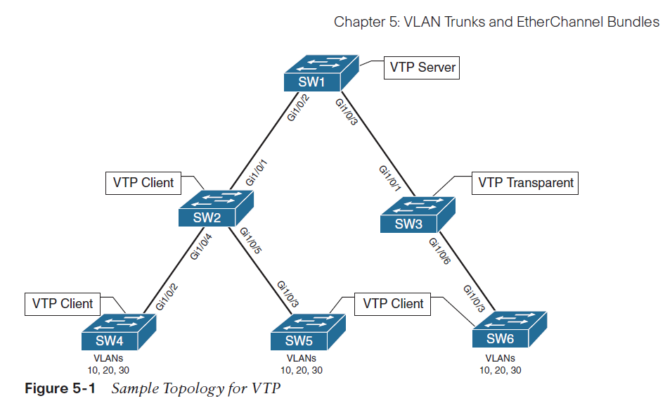

# CCNP ENCOR Study :computer: :desktop_computer: :floppy_disk:

- [CCNP ENCOR Study :computer: :desktop_computer: :floppy_disk:](#ccnp-encor-study-computer-desktop_computer-floppy_disk)
  - [Introduction and Purpose :wave: :v:](#introduction-and-purpose-wave-v)
  - [Study Resources and Tips :fireworks:](#study-resources-and-tips-fireworks)
    - [Official Certification Guide :blue_book: :thumbsup:](#official-certification-guide-blue_book-thumbsup)
    - [Lab, Lab, Lab :man_technologist: :woman_technologist: :computer: :keyboard: :computer_mouse:](#lab-lab-lab-man_technologist-woman_technologist-computer-keyboard-computer_mouse)
    - [Anki Flashcards :sparkler::thumbsup: :thumbsup: :thumbsup: :sparkler:](#anki-flashcards-sparklerthumbsup-thumbsup-thumbsup-sparkler)
    - [CBT Nuggets](#cbt-nuggets)
    - [Boson ExSim-Max](#boson-exsim-max)
    - [Honorable Mentions](#honorable-mentions)
  - [Final Thoughts](#final-thoughts)
  - [Appreciation](#appreciation)

## Introduction and Purpose :wave: :v:

Please be aware this is NOT the best study method in the world! Far from it! Everyone learns in different ways and this is just what has worked for me on my journey. I hope you enjoy and maybe grab even one thing from this document that may assist you in your certification journey.

Some small background on me. I've been working in networking for about 9 years. I obtained the old CCNP R/S a few years ago. I wanted to take on the challenge of the new exams after the "Certpocalypse" with the added blueprint points. As well as freshen up my own knowledge as I don't use everything in the blueprint in my day to day role.

## Study Resources and Tips :fireworks:

### Official Certification Guide :blue_book: :thumbsup:

[CCNP and CCIE Enterprise Core ENCOR 350-401 Official Cert Guide](https://www.ciscopress.com/store/ccnp-and-ccie-enterprise-core-encor-350-401-official-9781587145230)

In any certification tackled, I always start with the source. Cisco Press books can be up and down and the CCNP ENCOR book is no exception. I would recommend checking out the errata on the Cisco Press site and making all necessary corrections.

I'm a weirdo and read the book front to back. Call me old school! I think the OCGs tend to give you a fairly strong base towards passing the exam but I don't believe this alone will allow you to pass the exam.

I usually plan a set target on what I would like to accomplish that day or week with the book. If its a heavy topic like STP which spans multiple chapters, I may give myself a week to fully digest the material. Making sure to read all of the chapters and answer the questions at the start of every chapter. I will pay more attention around the question topics missed during the chapter reading. I am not a big fan of notes as I don't believe that helps me retain knowledge very well. More on that later.

### Lab, Lab, Lab :man_technologist: :woman_technologist: :computer: :keyboard: :computer_mouse:

You do not have to lab to pass this exam.... BUT you will be doing yourself a disservice by not labbing. I will bet many of us learn by doing and I am no different. At the end of the day we are not only learning to pass an exam but to become great engineers. Getting on the keys, building topologies, and thinking about design is all part of the path.

I dont want to push a particular labbing setup. Whether you decide to build a physical lab or something virtual. It all has pros and cons... or what the fancy engineers would say "tradeoffs". A lot of great Cisco gear can be purchased online for relatively low cost. Ill link a few virtual options below.

- [EVE-NG](https://www.eve-ng.net/)
- [GNS3](https://www.gns3.com/)
- [CML](https://learningnetworkstore.cisco.com/cisco-modeling-labs-personal/cisco-cml-personal)

Ill give you an example on how I would lab. Lets say we're reading through the OCG and they give us this great topology on VTP!

The rest of the book would walk the reader through VTP server vs client vs transparent modes. Reading is just part of the battle. Labbing as I read the book greatly helps me retain the information and really get the commands down! If you do not have a reference topology to start from just build it! Mess around with the lab and break it.. then fix it! Even better! Below is just a snippet from when I created the lab virtually.

### Anki Flashcards :sparkler::thumbsup: :thumbsup: :thumbsup: :sparkler:

### CBT Nuggets

### Boson ExSim-Max

### Honorable Mentions

## Final Thoughts

## Appreciation